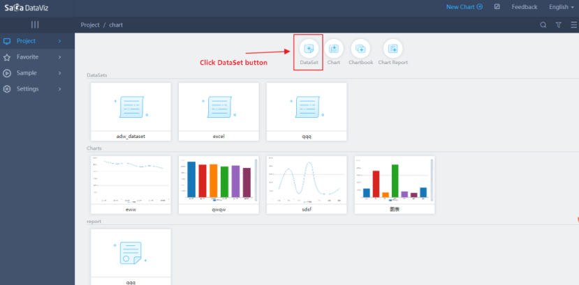
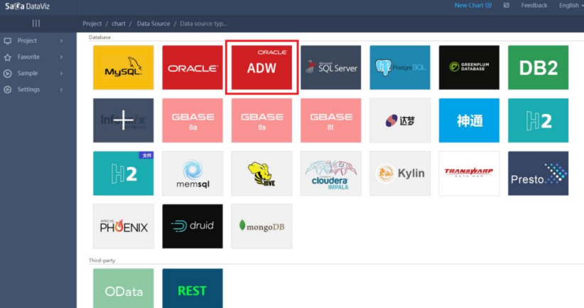

## **Connecting SaCa DataViz to Oracle Autonomous Database**

## **Introduction**

This guide shows you how to configure DataViz connectivity to Oracle Autonomous Database (ADB). 

These instructions use Oracle Instant Client from Oracle.

| Validation Matrix              | Version             |
| ------------------------------ | ------------------- |
| SaCa DataViz                   | V5.2.07 or above    |
| Oracle Database Instant Client | 12.1.0.2 and higher |

## **Prerequisites**

This document assumes the following:

- Autonomous Database (ADB) is provisioned. ADB includes Autonomous Data Warehouse (ADW) or Autonomous Transaction Processing (ATP), or Autonomous JSON Database (AJD).  To provision ADB, see [here](https://docs.oracle.com/en/cloud/paas/autonomous-database/adbsa/autonomous-provision.html#GUID-0B230036-0A05-4CA3-AF9D-97A255AE0C08).
- DataViz is installed.

## **Configuring DataViz**

1. Download the Wallet file from the ADB UI console. Keep the Credential wallet in its original format which is the Zip format.
2. Log into SaCa DataViz Home Page. Click the Project button to create a new project.

3. Click the DataSet button. 

4. Choose Oracle ADW as a data source under the ‘Data Source’section. As shown in the
following figure.

5. Enter the name of the Data Source. Browse and upload the ADB wallet zip file which
you downloaded before. Supply the database username, password and service name. Test your
connection by pressing the Test Link button.

6.  If the connection is successful, press the OK button. You are now ready to analyze/visualize. Now
you have successfully connected SaCa DatViz to ADB!

7.  After the completion of the DataSet, you can make self-service analytics and create your own
dashboard. 

For instructions on how to get started, follow the SaCa DataViz Video Tutorials available at [here](https://www.idataviz.com) and refer to the full set of online documentation [here](https://www.idataviz.com/doc/).

## **Acknowledgements**

* **Author(s)** - Vijay Balebail, Milton Wan, Database Product Management
* **Contributor(s)** - 
* **Last Updated By/Date** - Milton Wan, December 2022
