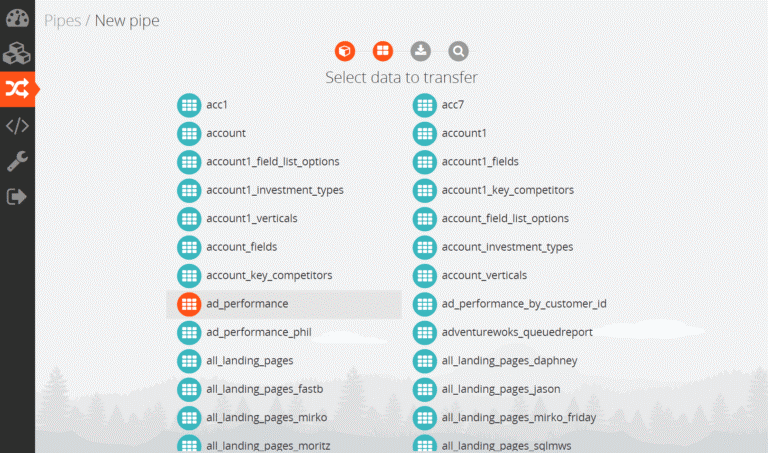
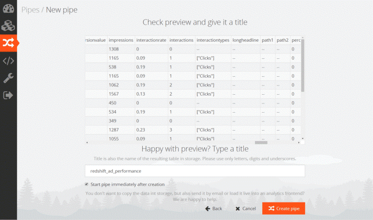

# Creating a connection from DataVirtuality Pipe to Oracle Autonomous Data Warehouse (ADW)

### **Introduction**

| Validation Matrix  | Version  |
| ------------- | ------------- |
| DataVirtualityPipes | 2018-06 |
| DataVirtualityPipes Professional | 2018-06 |
| DataVirtualityLogical Data Warehouse  |   2.0.46  |
| Oracle Database JDBCdriver  | ojdbc7.jar -12.1.0.2 JDBC Drivers & UCP for CloudRelease  [Note: This is different from the RELEASE version of the JDBCdriver as it contains the fix to supportTLSv1.2]  |

### **Prerequisites**

- Required access and credits to provision ADWC instance on Oracle Cloud.
- Download Oracle JDBC Thin driver is downloaded on the app server.
- If ADWC is already configured you have the ADMIN user password and ADB Wallet is downloaded on app server.  For the Oracle documentation to provision ADW please [check here](https://docs.oracle.com/en/cloud/paas/autonomous-database/adbsa/autonomous-provision.html#GUID-0B230036-0A05-4CA3-AF9D-97A255AE0C08).

## Create DataVirtuality Pipes connection

1. Log into DataVirtuality Pipes Log into DataVirtuality Pipes here. If you do not have an account, start your 14 days trial here. Follow the instructions in this DataVirtuality document to configure your Oracle ADW as the target storage of your data.

2. Set up Oracle ADW as the target storage: Choose Oracle ADW as the destination and enter the credentials. Enter the connection details and upload your wallet in Pipes. Click “Connect” to finalize the first step.

  

3. Second, connect data sources (cloud-based SaaS as well as databases): Click “Plus” to connect with the desired data source, e.g. Redshift and enter the credentials. In the advanced options, click on “Edit” and choose, for example SSL, if needed. The connect wizard is finished and the data from the original data source(s) can now easily be moved into Oracle ADW.   

  

4. Third, create data pipeline: Go back to the dashboard and choose data source. Locate the table that needs to be moved, e.g. ad_performance table and take a preview of the data which will be moved. They will look the same in Oracle ADW after moving the data is finalized

  

5. There are some load options under “Load Settings”. Check “Incremental” in the scheduling option because otherwise, the whole table will be moved every time. The value in the criteria field will be compared with the latest value in Oracle ADW to see whether the value should be rolled over or not.

  

6. The field “ID” is optional. If this field is set, DataVirtuality Pipes decides whether the data will append the role or replace the existing role with the same ID.

7. Name the pipe and click “Create Pipe”.

  

8. Lastly, review the execution steps: Mark the newly created pipe and review the details. Check the status of the execution, the duration and the time when it was done. Review the table that was moved into Oracle ADW by going to Oracle SQL Developer. Click on the table

that was moved, e.g. redshift_ad_performance. Look at the data that had been moved.

  

## FAQ

1. Which databases and APIs are supported?
    - DataVirtuality Pipes: 50+ connectors.
    -	DataVirtuality Logical Data Warehouse: 150+ connectors.

2. What is the supported frequency of data movement?
    -	DataVirtuality Pipes: You can determine how often the data should be moved yourself. In the third step “Create Pipes to integrate the data”, you have the option to schedule the frequency of data movement under the load settings. We recommend to check the incremental button, otherwise the whole table will be moved every time.
    -	DataVirtuality Logical Data Warehouse: With the sophisticated scheduling of DataVirtuality Logical Data Warehouse, you can replicate your data every minute, if needed. Dependencies on other replication jobs are also configurable. Watch the following video to get more detailed insights: [https://vimeo.com/175877949](https://vimeo.com/175877949)

3. What types of data movement are supported?

  DataVirtuality supports multiple data movement types depending on the different use cases. Learn more about the specific algorithmic concepts behind each type and usage: [https://datavirtuality.com/docs/#doc=User%20Guide&version=2.0&page=Replication_and_Materialization.html](https://datavirtuality.com/docs/#doc=User%20Guide&version=2.0&page=Replication_and_Materialization.html)

  The following topics are covered in this user guide:
    -	Complete Materialization
    -	Incremental Replication (Movement)
    -	Batch Replication (Movement)
    -	History Update (slowly-changing-dimension)
    -	Copy Over
    -	Upsert Update
    -	Overview of Replication (Movement) Types

## **Acknowledgements**
* **Author(s)** - Vijay Balebail, Director Product Management
* **Contributor(s)** -
* **Last Updated By/Date** -  Rajeev Rumale - January 2021
