# **Connecting Erwin Data Modeler to Oracle Autonomous Database**

### Pedro Torres

This step by step tutorial guides how to configure Erwin Data Modeler connectivity to Oracle Autonomous Database (ADB).

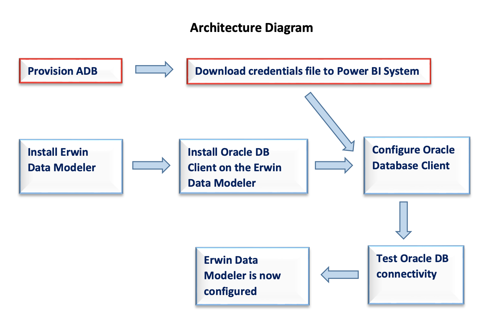

This document assumes that an ADB, such as Autonomous Data Warehouse (ADW) or Autonomous Transaction Processing (ATP), was provisioned.

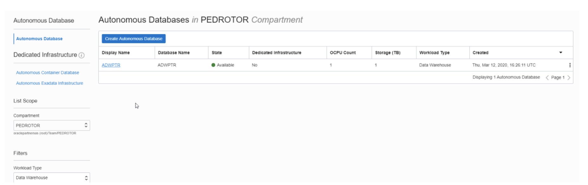

*Note: Please check here for the Oracle documentation to [provision ADW](https://www.oracle.com/webfolder/technetwork/tutorials/obe/cloud/adwc/OBE_Provisioning_Autonomous_Data_Warehouse_Cloud_bak/provisioning_autonomous_data_warehouse_cloud_v2.html).

1. Download the corresponding credentials zip file to the system that has Erwin Data Modeler installed.

​	These credential files will be used to connect Erwin Data Modeler to ADB.

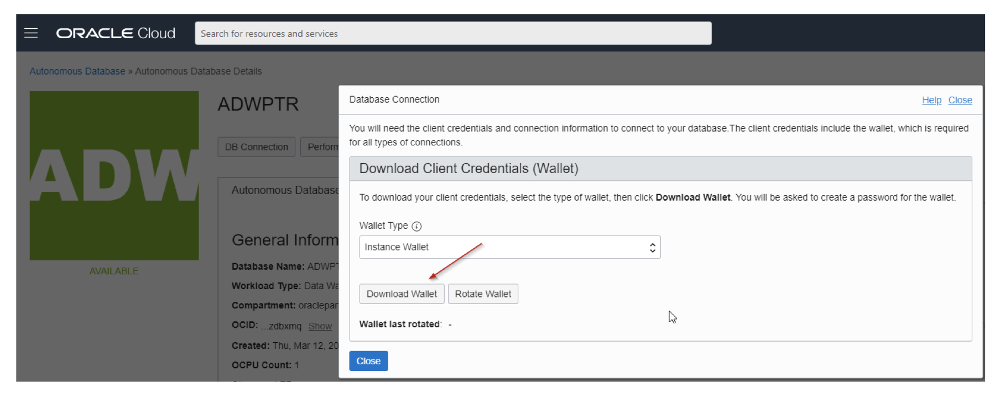

*Note: Also check Downloading Client Credentials (Wallets).

2. Download and Install Erwin Data Modeler – https://erwin.com/order-fulfillment/

   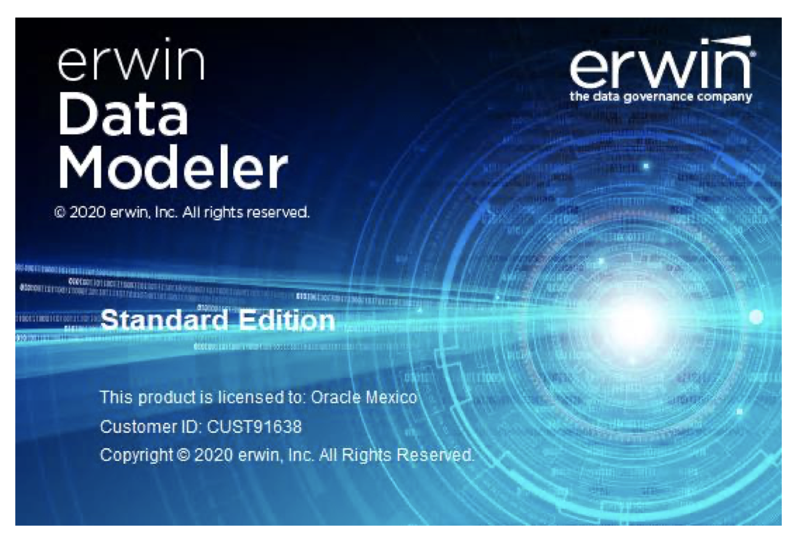

3. Validate if you are using Windows version for 32-bit or 64-bit. Control Panel -> System and Security -> System

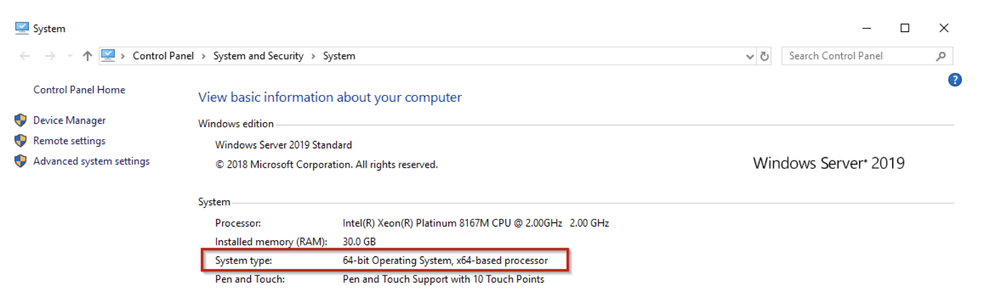

4. In this case is for 64 bits

   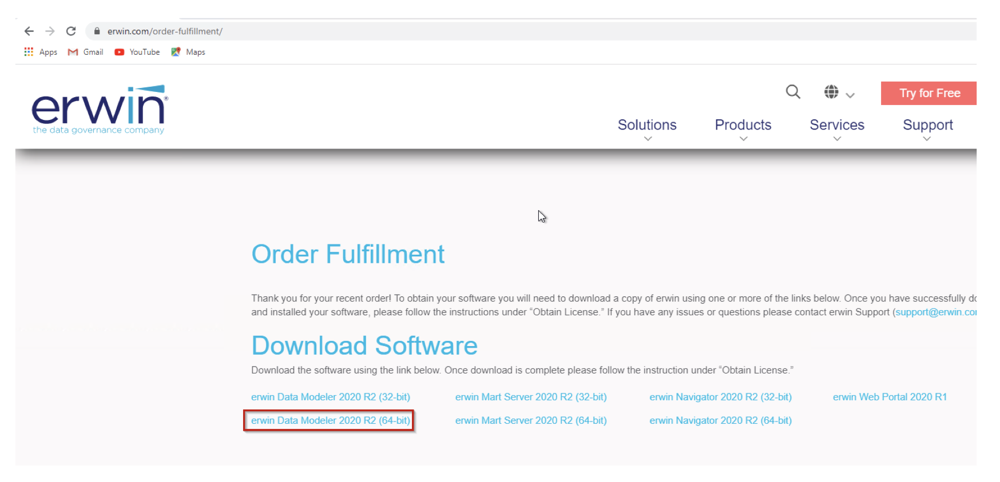

5. The following instructions assume you are using 62-bit. If you are using 32-bit, the instructions are the same, except to download the 32-bit Erwin Data Modeler.

6. Download Oracle Client 19.3 of this Oracle.com web page:

​		https://www.oracle.com/database/technologies/oracle19c-windows-downloads.html

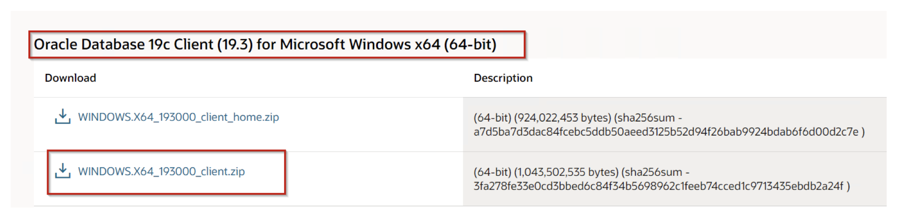

7. Install the Client.

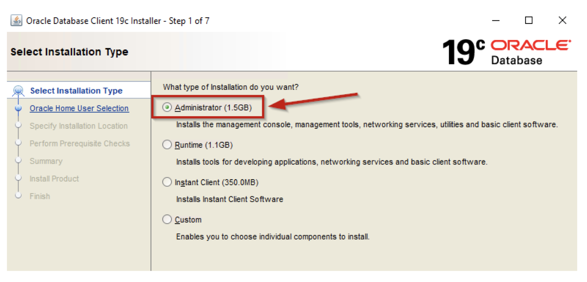

8. Navigate to where you downloaded the Oracle ADB credentials. Unzip the contents to a directory.

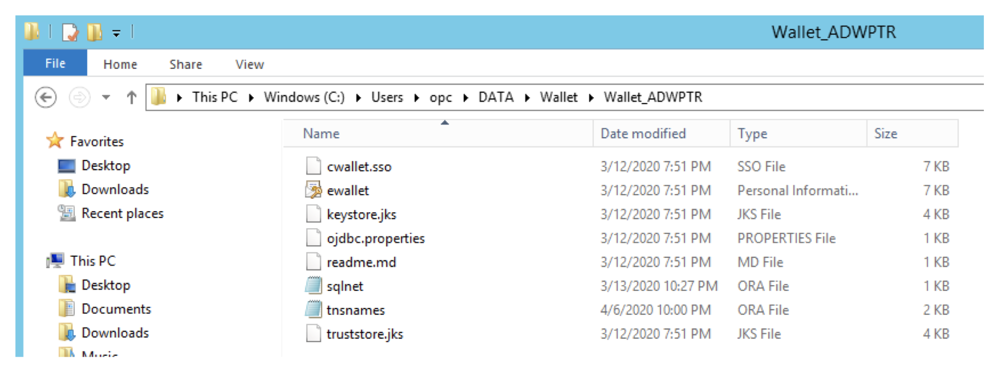

9. I will use Physical according the TNSNAMES.ora in the wallet file

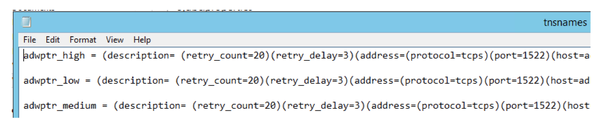

10. In the Windows environment variables dialog, create the TNS_ADMIN variable and set it to the directory location where you unzipped the ADB credentials.

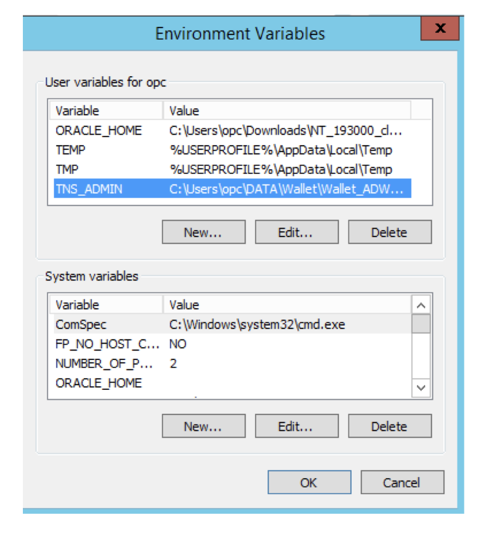

​		*Note: The tnsnames.ora net service names will be used to connect to ADB.

11. Modify the sqlnet.ora file. Change the directory location where the wallet (cwallet.sso) has been unzipped. It is recommended you remove the quotes around the directory location as well.

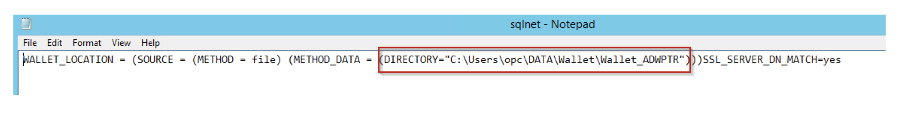

12. Validate that the Oracle Database Client can communicate with ADW, and since it is installed on the same system as the Erwin Data Modeler, it ensures that Erwin to ADW is also configured correctly. (you can use SqlDeveloper to validate)

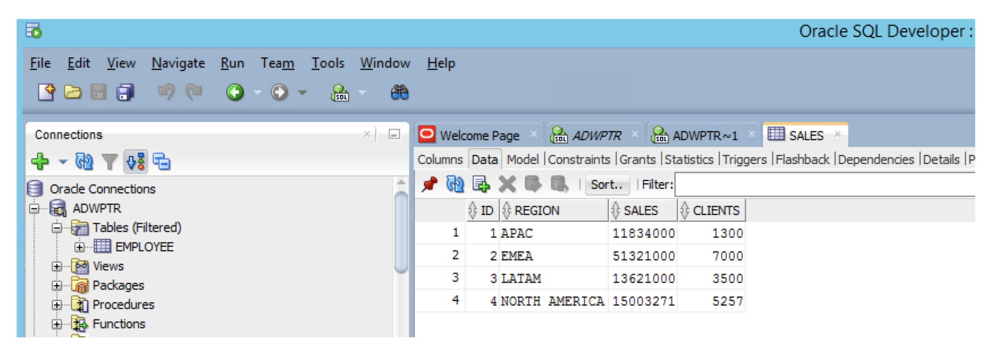

13. Open Erwin Data Modeler and create a file.

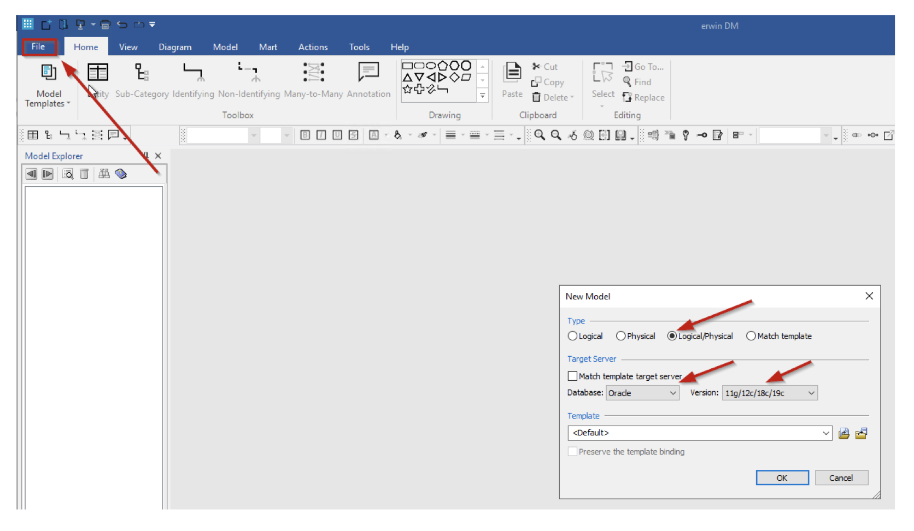

14. Use reverse Engineer

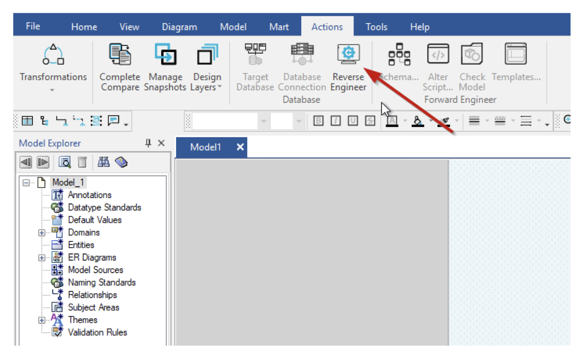

15. Select the objects that you need validate in your Reverse Engineer file.

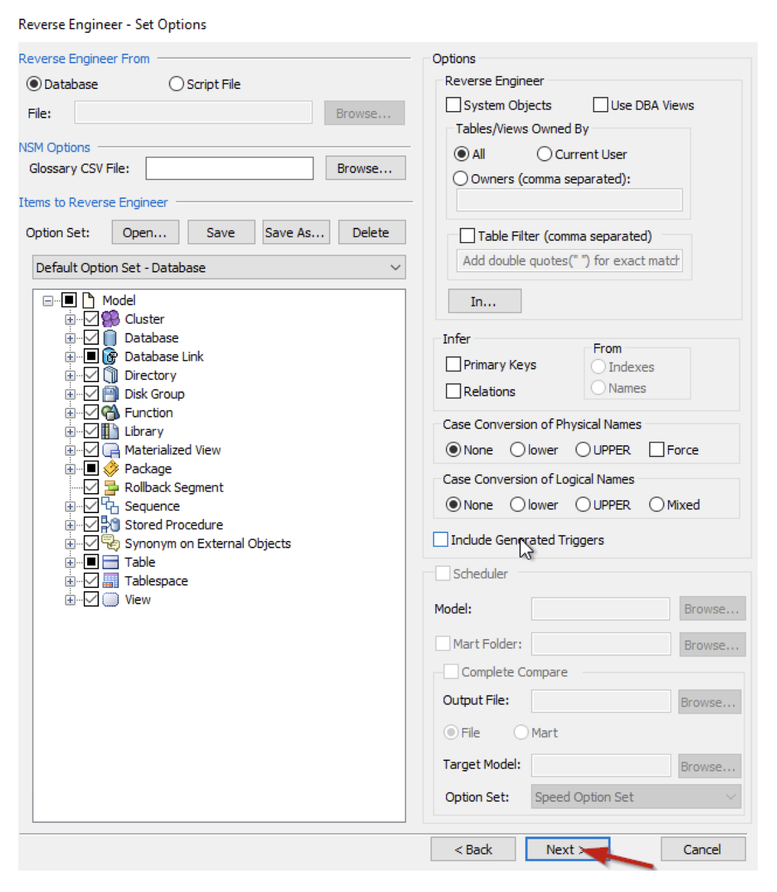

16. Connect to user that you need to do reverse Engineer and retrieve the information (in this case PTORRESR):

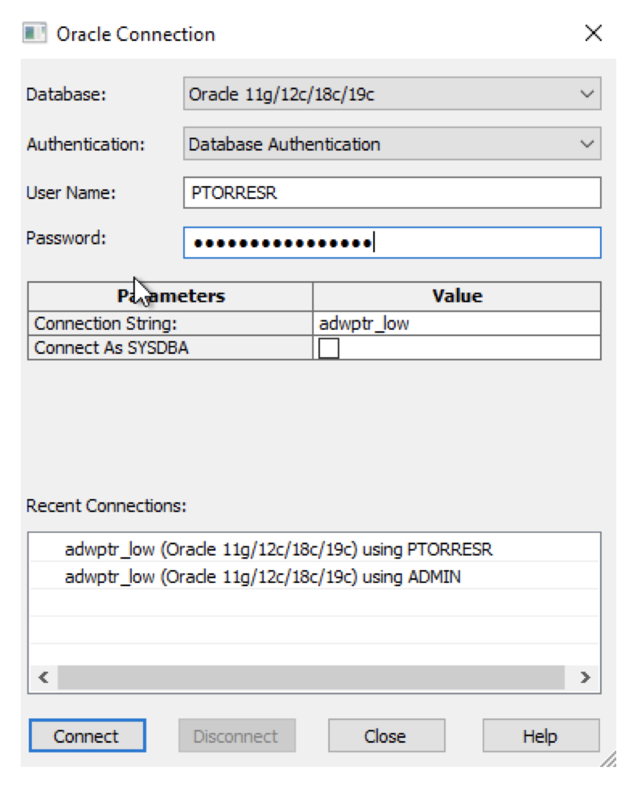

17. Validate report from the ADW

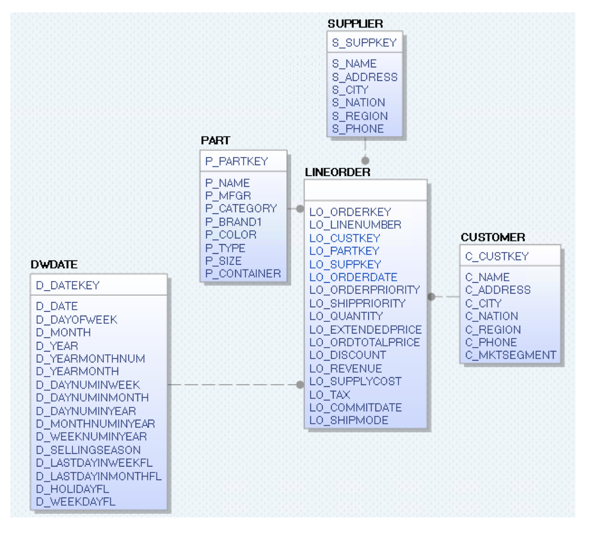