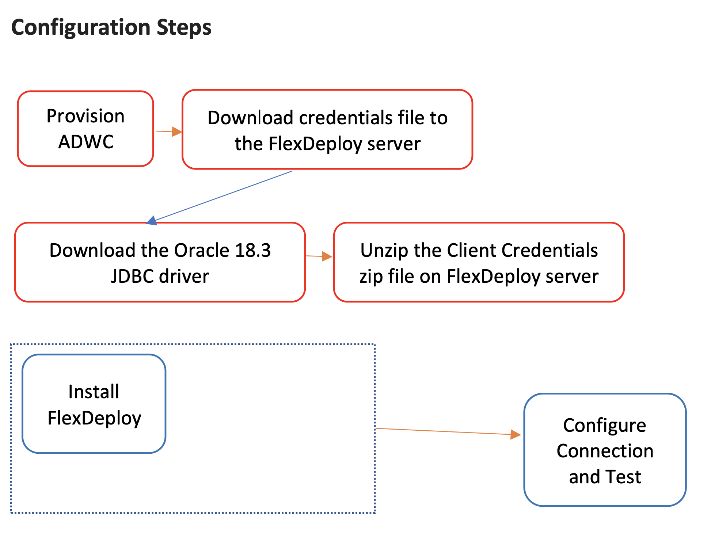

# **Creating a connection from FlexDeploy to Oracle Autonomous Data Warehouse (ADW)**

Step 1: Provision ADWC plus Install and Configure Oracle Client

1. Provision Autonomous Data Warehouse Cloud (ADWC) and download the corresponding credentials.zip file to the system that will have the FlexDeploy installation. For the Oracle documentation to provision ADWC click here. Also check [Downloading Client Credentials (Wallets).](https://docs.oracle.com/en/cloud/paas/autonomous-data-warehouse-cloud/user/connect-download-wallet.html#GUID-B06202D2-0597-41AA-9481-3B174F75D4B1)

2. All connections to Autonomous Data Warehouse Cloud use certificate-based authentication and Secure Sockets Layer (SSL). Uncompress credentials.zip file into a secure folder.
3. Download the Oracle 18.3 JDBC drivers to the system where FlexDeploy is installed.

Step 2. Install FlexDeploy

To install FlexDeploy software please refer to the Install [Documentation](https://flexagon.atlassian.net/wiki/spaces/FD51/overview).

Step 3: Configuring FlexDeploy to connect with ADWC

- FlexDeploy uses a JDBC thin driver to connect to ADWC. 

- Configuration depends on the application server being used. Refer to FlexDeploy Install

  Documentation for details on each application server. 

- Example of connecting Tomcat to ADWC:

  a. Install 18.3 JDBC driver by removing ojdbc6dms.jar and putting the 18.3 jar files in the apache-tomcat-flexdeploy\lib directory

  b. Add this to the CATALINA_OPTS line of the setenv.bat file: 

  ​	i. -[Doracle.net](http://doracle.net/).tns_admin=D:\tns_admin

  ​	ii. Note*** Directory is the location of the uncompressed credentials.zip from 1.2

​		c. Set the JDBC URL in the context.xml file to look like this:

			i. url="jdbc:oracle:thin:@flexagon_high"

​			ii. Note *** The name should match an entry in the tnsnames.ora file.