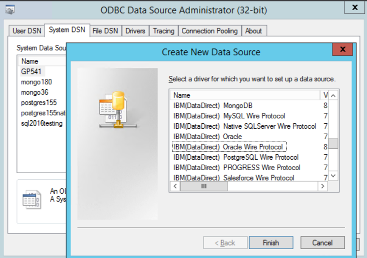
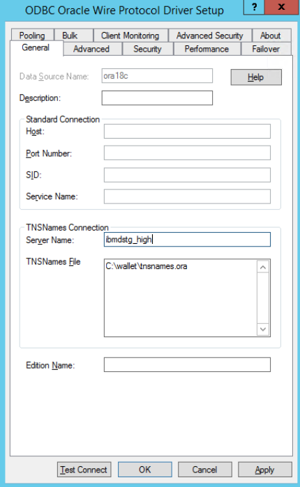
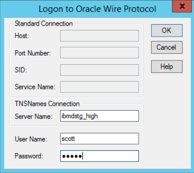
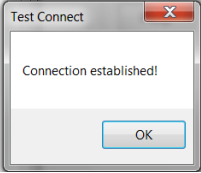

# Connecting IBM Datastage to Oracle Autonomous Database

## About this Workshop

This document describes how to generally setup and configure Data Direct ODBC	driver
(Data	Direct	Oracle	Wire	Protocol), for	tool	vendors	using	this provider	such	as	IBM
DataStage. Please check the analytic tool documentation in case they have specific
connectivity	interfaces.

### About Product/Technology
Oracle Autonomous Data Warehouse (ADW) supports [connections](https://docs.progress.com/category/datadirect-oracle) from	standard drivers
including JDBC, ODBC, and ADO.NET. Analytic tools may use 3rd party drivers from
providers	such as Data Direct. In order to work with ADW, the driver must support [Oracle Wallets](https://docs.oracle.com/cd/E92519_02/pt856pbr3/eng/pt/tsvt/concept_UnderstandingOracleWallet.html?pli=ul_d96e224_tsvt#:~:text=Oracle%20Wallet%20is%20a%20container,is%20used%20for%20security%20credentials.)	and	SSL	encryption.
Not	all	analytic	tools	package	the	latest	driver	versions,	so	you	may be required to update the driver to the	latest	[versions](https://www.oracle.com/database/technologies/appdev/jdbc-downloads.html) 	before	you	can	successfully connect

### Objectives

In this lab, you will:
* Provision ADW
* Download Credentials and Drivers
* Install Datadirect
* Download drivers
* Test Connection

### Prerequisites

* An Oracle Free Tier, Always Free, Paid or LiveLabs Cloud Account
* An IBM Cloud Account

## Prepare your environment

1. Provision an ADW Instance. If you are unsure on how to do so click [here](https://docs.oracle.com/en/cloud/paas/autonomous-database/adbsa/autonomous-provision.html#GUID-0B230036-0A05-4CA3-AF9D-97A255AE0C08)

## Configure Data Direct with Oracle Wire
1.  Download the credentials file from the ADW administration console and unzip the file. If you do not know how to do that click [here](https://docs.oracle.com/en/cloud/paas/autonomous-data-warehouse-cloud/cswgs/autonomous-connect-download-credentials.html#GUID-B06202D2-0597-41AA-9481-3B174F75D4B1). The location of this files directory will now be referred to as the `wallet_directory`.

  * **Note:** Oracle credentials file is a zipped file that contains all the wallet formats as well as a predefined tnsnames.ora and sqlnet.ora that will be required to make a tnsnames based connection. This credentials file is protected by a password based encryption. Hold on to this password as you will use this password later on during the driver configuration. It will be referred to as `KeyStore/TrustStore` password.

2. Please refer to the Progress DataDirect documentation [here](https://docs.progress.com/bundle/datadirect-odbc-installation/page/Welcome-to-the-Progress-DataDirect-for-ODBC-Drivers-Installation-Guide.html) to install and configure the DataDirect Oracle Wire driver based on your OS. DataDirect Oracle Wire driver is available for Windows (32 bit/64 bit), Unix/Linux.
  * **Note:** Only the 32-bit version of the drivers is supported for DataStage on Windows.

3. Download the DataDirect ODBC Drivers. Once unzipped and installed, open the 32-bit ODBC Administrator on Windows to configure the system DSN.

    

4.  Click on Add to configure a new system DSN under the System DSN tab. Locate the DataDirect 8.0 Oracle Wire Protocol from the list of drivers presented to you and press `Finish`.

    

5.  You will then be presented with a form for the DSN attributes. Fill in the DSN name, your TNS service name (this can be found in the tnsnames.ora file in TNS_ADMIN location) and complete path to the tnsnames.ora  `(<wallet_directory>\tnsnames.ora)`

    

6. . Next click on the `Security` tab and choose Encryption Method to be 1-SSL in the Encryption section. Also supply the path and name of the wallet to be used. Data Direct prefers the ewallet.p12 wallet file. The path should be `<wallet_directory>\ewallet.p12.` Supply this information for both the Trust Store as well as the Key Store sections. The password to be supplied here is the `KeyStore/TrustStore` password. You may optionally supply the Database username in the Authentication section.

    

7. Test your connection by pressing the `Test Connect` button. Supply the database
username and password to test the connection

  

8. You should get a Connection Established message.

  

9. You are now ready to use this system DSN for your application!

  * **Note:** These instructions are for reference purposes only. As versions of this driver
  changes,	there may be different configuration methods. Please refer to the vendor website
  for	latest details. Please refer to the vendor documentation on all the configuration options
  that	are	available	for	you	to	set.

## Additional Links
* [Why DataDirect?](https://www.progress.com/faqs/datadirect-odbc-faqs/datadirect-odbc-features/oracle-wire-protocol-odbc-driver)

## Acknowledgements
* **Author** - <Blake Hendricks, Database Product Manager, 6/6/2022>
* **Adapted for Cloud by** -  <Name, Group> -- optional
* **Last Updated By/Date** - <Name, Group, Month Year>
* **Workshop (or Lab) Expiry Date** - <Month Year> -- .
