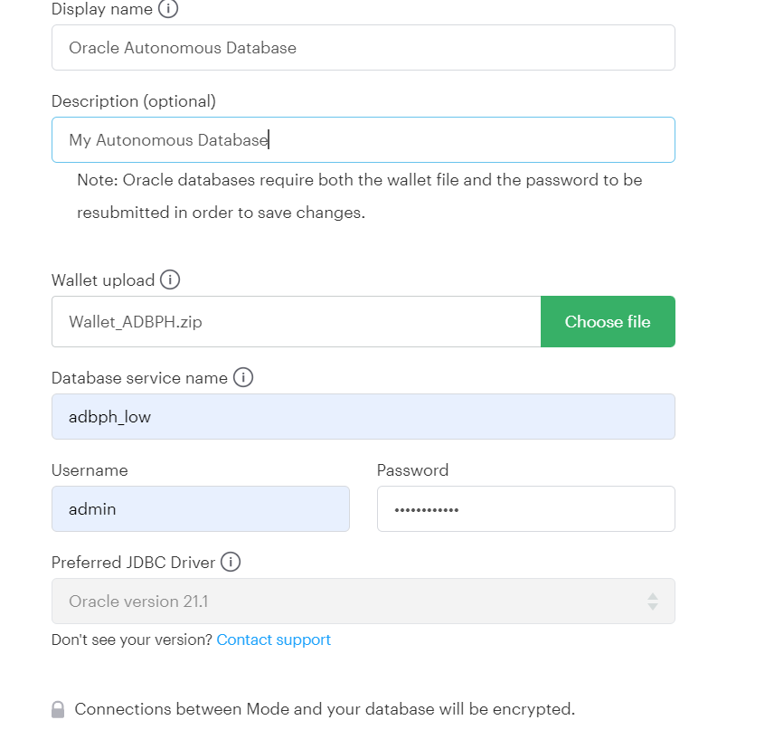
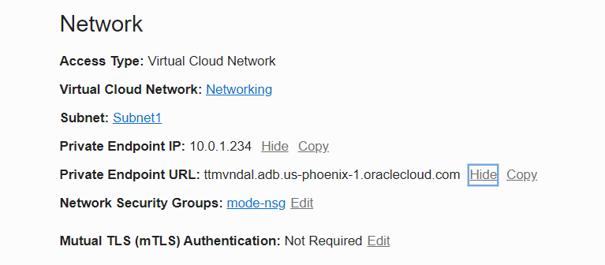
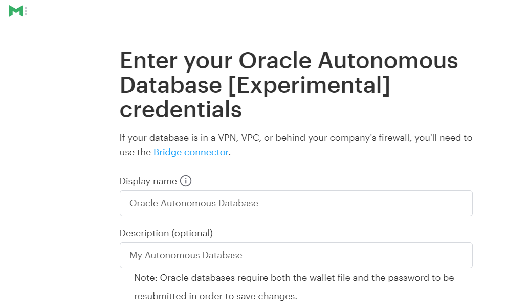
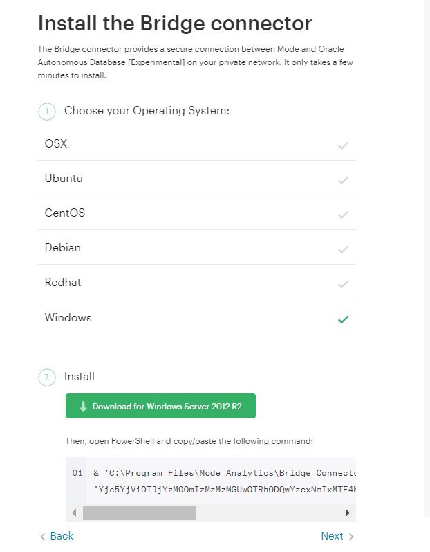
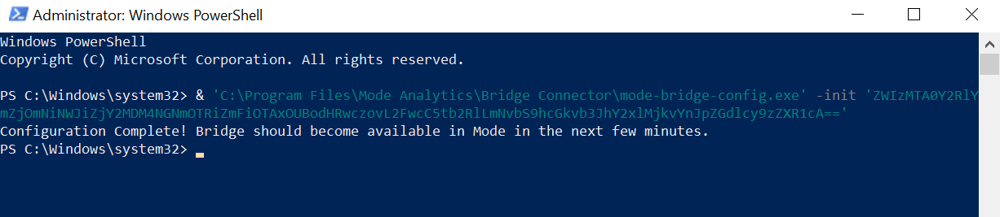
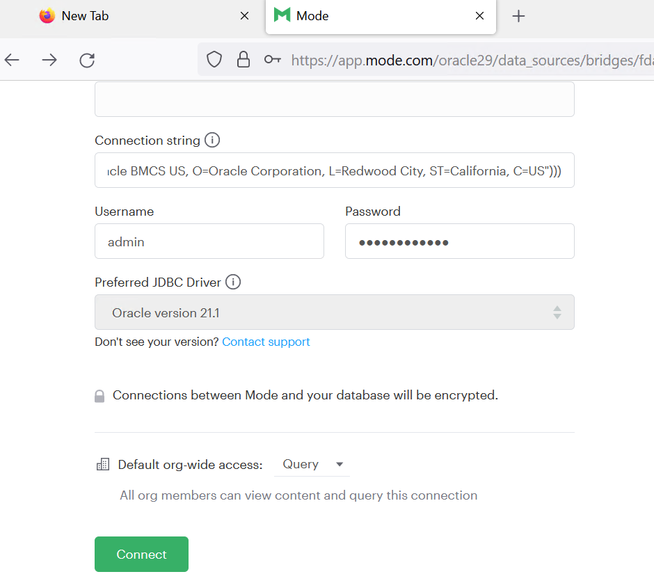
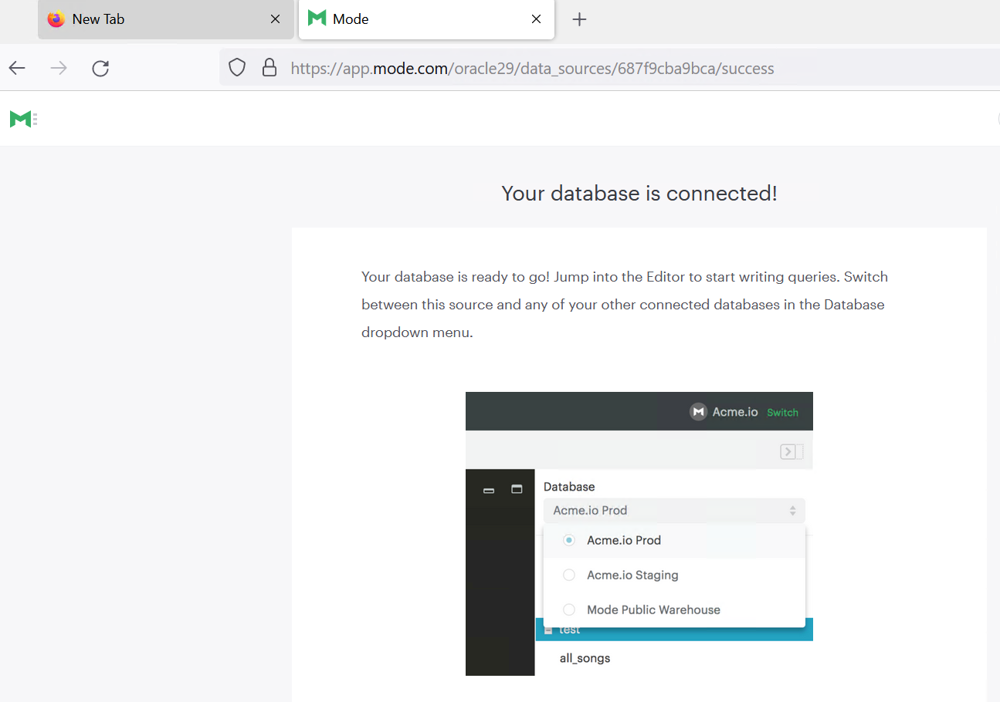

## **Connecting Mode to Oracle Autonomous Database**

This guide shows you how to configure Mode connectivity to Oracle Autonomous Database (ADB).

## **Prerequisites**

This document assumes the following:

- Autonomous Database (ADB) is provisioned. ADB includes Autonomous Data Warehouse (ADW) or Autonomous Transaction Processing (ATP), or Autonomous JSON Database (AJD).  To provision ADB, see [here](https://docs.oracle.com/en/cloud/paas/autonomous-database/adbsa/autonomous-provision.html#GUID-0B230036-0A05-4CA3-AF9D-97A255AE0C08).

- You have access to a Mode account.  

- To connect with the Mode Bridge, you will need to have a VCN and private subnet created in the Oracle Cloud.

  

## **Connecting Mode with Direct Connect**

Mode allows connections to ADB from the internet.  This type of connection requires the ADB Wallet.  

1. Simply [download](https://mode.com/help/articles/supported-databases/#oracle) the ADB Wallet zip file to your computer.   

2. Go to Mode's Connect to database page.

3. Select Autonomous Database.

4. Enter a name for the database.

5. Choose and upload the ADB Wallet zip file.

6. You can keep the latest JDBC driver.

7. Enter your username and password, and connect.

## **Connecting Mode with a Bridge**

Mode allows secure connections to ADB without the use of the ADB Wallet through a bridge.  The bridge is installed in a docker container or on an OCI compute running either Linux or Windows.  The bridge must run on a VCN that is also set up with a private endpoint to ADB.

1. To set up the private endpoint to ADB, see [here](https://docs.oracle.com/en-us/iaas/Content/Database/Tasks/adbcreating_topic-To_configure_private_endpoint_access_via_a_virtual_cloud_network_VCN.htm#To_configure_private_endpoint_access_via_a_virtual_cloud_network_VCN).

2. To set up ADB to use TLS and not the Wallet see [here](?lab=no-wallet).

Your ADB private endpoint details should look like the below picture.

3. Select the Bridge connector from the Mode database connect screen.  To run the Bridge in a docker container, see [here](https://mode.com/help/articles/connecting-mode-to-your-database/#run-bridge-in-a-docker-container).

4. Select connect to new Bridge.

5. Choose the OS for your Bridge and download.

6. Run the command in Powershell administrator mode.

You should see this if the Bridge installation is successful.

7. Now [locate](https://mode.com/help/articles/supported-databases/#oracle-autonomous-database-(private-endpoint)) the ADB connect string for TLS and enter it in the Mode database connection screen.

You should see a successful database connection.

## **Acknowledgements**

* **Author(s)** - Milton Wan, Database Product Management
* **Contributor(s)** -
* **Last Updated By/Date** - Milton Wan, December 2021
