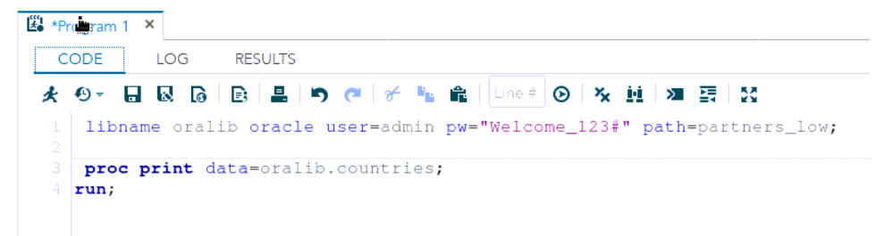
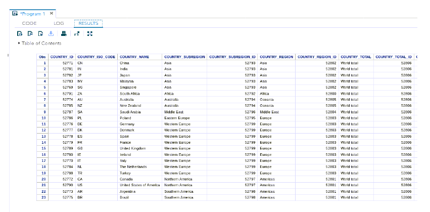

## **Connecting SAS/ACCESS to Oracle Autonomous Database**

This guide shows you how to configure SAS/ACCESS connectivity to Oracle Autonomous Database (ADB). 

## **Prerequisites**

This document assumes the following:

- Autonomous Database (ADB) is provisioned. ADB includes Autonomous Data Warehouse (ADW) or Autonomous Transaction Processing (ATP), or Autonomous JSON Database (AJD).  To provision ADB, see [here](https://docs.oracle.com/en/cloud/paas/autonomous-database/adbsa/autonomous-provision.html#GUID-0B230036-0A05-4CA3-AF9D-97A255AE0C08).
- Oracle Database Client is downloaded and installed on your machine running SAS/ACCESS.  To install Oracle Database Client see [here](https://www.oracle.com/database/technologies/instant-client/winx64-64-downloads.html).
- ADB Wallet is downloaded on your machine running SAS/ACCESS.

## **Configuring with Oracle Client**

1. Follow the instructions from the SAS [documentation](https://documentation.sas.com/doc/en/pgmsascdc/9.4_3.5/acreldb/p1ujrhdoe1p743n12awcf7mwyg81.htm) to install and configure SAS/ACCESS Interface to Oracle.  As a prerequisite make sure that you have installed the Oracle Database Client 12.1.0.2 or higher on the SAS/ACCESS environment.

2. We first validate that the Oracle Database Client can communicate with ADB, and since it is installed on the same system as the SAS/ACCESS, it ensures that SAS/ACCESS Interface to Oracle is also configured correctly.

3. Test the Oracle Client with Oracle SQL*Plus
   `sqlplus password/\"Password\"@ConnectString`
   or
   `sqlplus /nologsql> set define off`

   `sql> connect username/password@connectString`

   Now that you have successfully configured the Oracle Client it is time to test SAS/ACCESS connectivity to ADB. Once the connection is established at the Oracle client layer,there is no change in configuration required from the SAS/ACCESS layer.  

   `libname oralib oracle user=admin pw=<ADB password> path=<service name from tnsnames.ora>;`

   Note: if you are using the ADB wallet, you can add the wallet directory path in the my_wallet_directory parameter as below:
   
   ```
   adwptr_high = (description= (retry_count=20)(retry_delay=3)(address=(protocol=tcps)(port=1522)(host=adb.us-phoenix-1.oraclecloud.com))(connect_data=(service_name=bk8ui2h_adwptr_high.adwc.oraclecloud.com))(security=(ssl_server_cert_dn="CN=adwc.uscom-east-1.oraclecloud.com, OU=Oracle BMCS US, O=Oracle Corporation, L=Redwood City, ST=California, C=US")(MY_WALLET_DIRECTORY=C:\DATA\WALLET\Wallet_ADWPTR)))
   ```
   
   
   
4. Test out the connectivity using a tool like SAS Studio and run the following script to connect to ADB.






You are now ready to start exploring and visualizing your data.


## **Acknowledgements**

* **Author(s)** - Vijay Balebail, Database Product Management
* **Contributor(s)** - Milton Wan
* **Last Updated By/Date** - Milton Wan, December 2021
